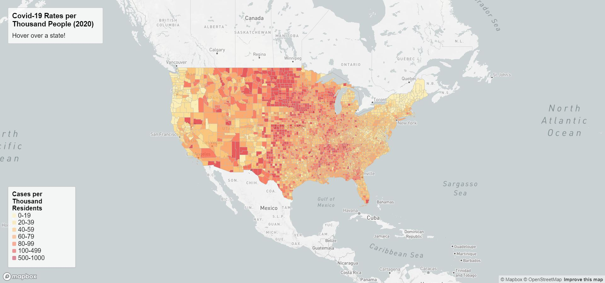
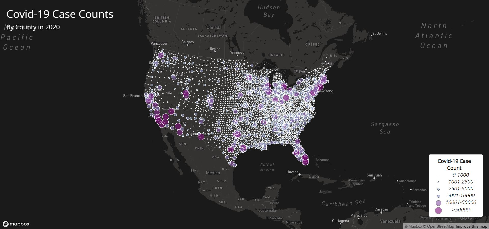

# Covid-19 Web Map Application

## Introduction
The Covid-19 pandemic that started in 2020 affected everyone around the world. This project will examine how Covid-19 affected the contiguous United States and which areas experience the worst amounts and rates of cases.

## Maps
Map 1 is a choropleth map of Covid-19 rates by county from 2020. When a county is hovered over with the mouse, the county name and what the Covid-19 case rate is per 1000 residents will appear under the title.

Map 2 is a proportional symbol map that displays the count of Covid-19 cases by county from 2020. There is a dot in the center of each county and when clicked, a window will appear that states the number of cases in this area.

Both maps utilize the Mapbox library to create the map object.

## Data Sources
The Covid-19 case data is originally from the [New York Times](https://github.com/nytimes/covid-19-data/blob/43d32dde2f87bd4dafbb7d23f5d9e878124018b8/live/us-counties.csv). The population data used for calculating the case rates are from the [2018 ACS 5 year estimates](https://data.census.gov/table?g=0100000US$050000&d=ACS+5-Year+Estimates+Data+Profiles&tid=ACSDP5Y2018.DP05&hidePreview=true). The data for the county boundaries is from [the U.S. Census Bureau](https://www.census.gov/geographies/mapping-files/time-series/geo/carto-boundary-file.html).

## Acknowledgement
The data files and instructions on how to make the thematic maps were provided by Bo Zhao and Steven Bao.